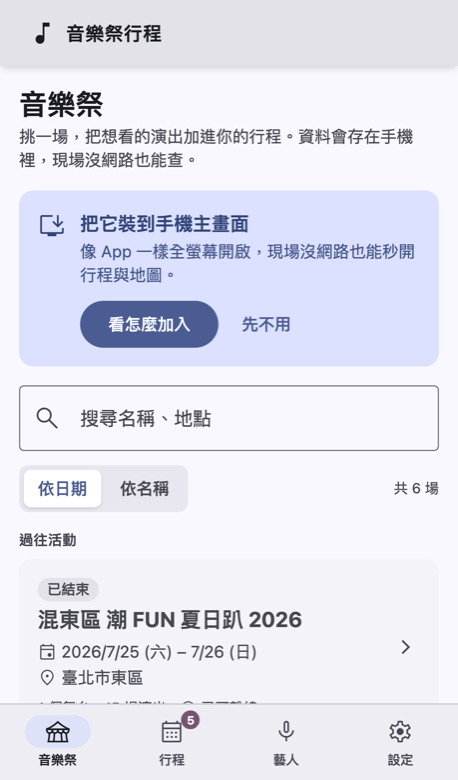
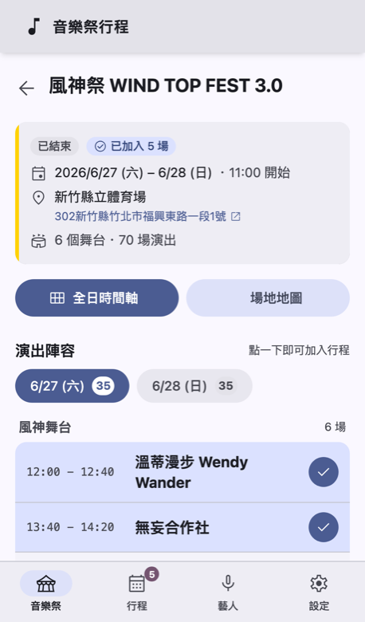
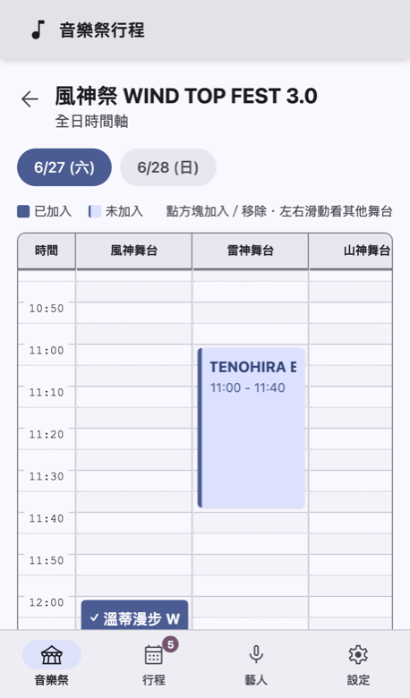
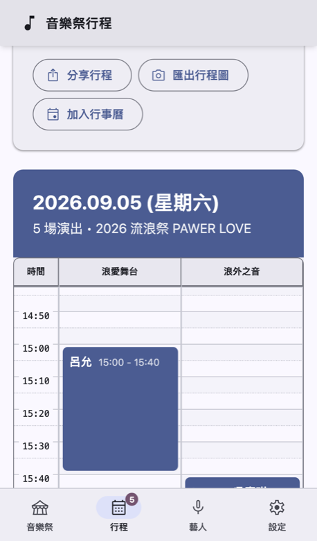
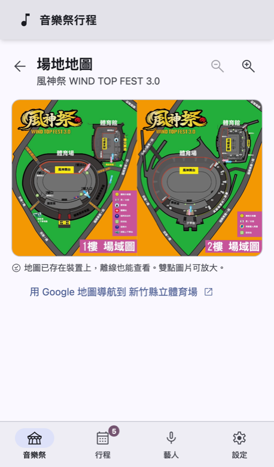
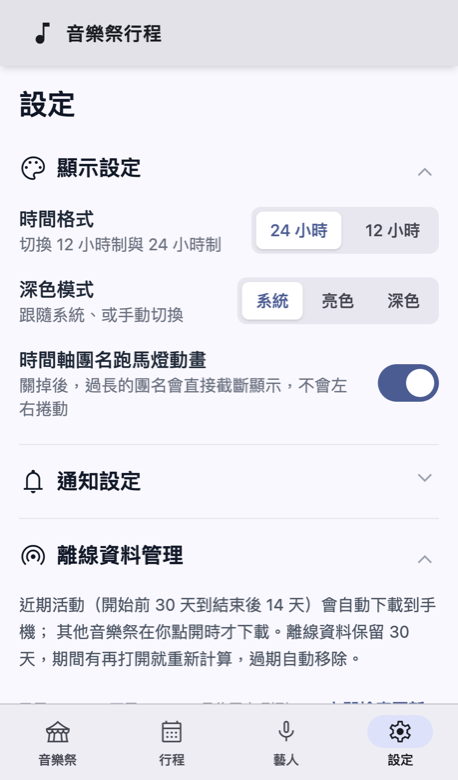
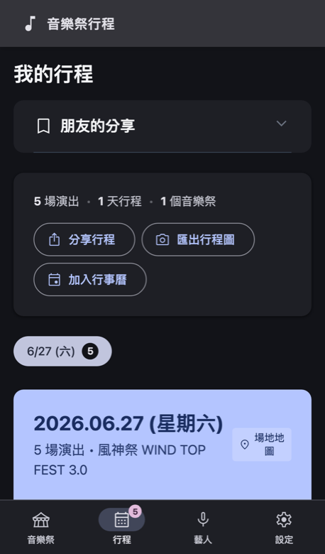

# 🎵 音樂祭行程 Music Festival Timeline

**離線優先的音樂祭行程規劃 PWA。** 瀏覽各音樂祭的完整時間表、把想看的演出排成自己的行程、演出前收到提醒，現場沒訊號也能查。裝到手機主畫面後就像一個原生 App。

> An offline-first PWA for festival-goers: browse timetables, build a personal run-down, get reminders before each set, and keep everything usable with zero signal on site. Traditional Chinese UI.

<p align="center">
  
  
  
  
</p>
<p align="center">
  
  
  
</p>

---

## ✨ 功能

| | |
|---|---|
| 🎟 **音樂祭列表** | 進行中／即將到來與過往活動分區，狀態徽章（進行中、N 天後、已結束）、已加入場數、離線可用標記。 |
| 📋 **演出陣容** | 依日期切換，每個舞台的演出一列一場，**點一下就加入行程**，再點一下移除。 |
| 📅 **全日時間軸** | 多舞台甘特圖，5 分鐘一格、今天有紅色「現在」線並自動捲到當下，一鍵跳回現在。 |
| 🗓 **我的行程** | 跨音樂祭、跨日的個人行程；下一場倒數卡、跨舞台**時間衝突警示**、匯出行程圖、加入行事曆（.ics）。 |
| 🔔 **演出提醒** | 演出前自訂分鐘數（1～60 分）推播，音樂祭前 7 天／1 天提醒。透過 Service Worker 觸發，分頁失焦也會跳。 |
| 🔗 **分享行程** | 雲端短網址（雙方連網）或 **QR Code 離線分享**（雙方都不用網路），朋友可一鍵套用或另存。 |
| 🗺 **場地地圖** | 圖片可放大捲動，離線也看得到；一鍵開 Google 地圖導航。 |
| 🎤 **聽過的藝人** | 從行程自動統計看過哪些藝人、看了幾次、跨了幾個音樂祭。 |
| 📡 **真正離線** | 近期活動（開始前 30 天到結束後 14 天）自動下載到裝置；其他活動點開時才下載。離線資料保留 30 天，期間有再打開就延長，過期自動清除。詳見 [`docs/OFFLINE.md`](docs/OFFLINE.md)。 |
| 📲 **安裝到主畫面** | Android／桌面 Chrome 直接跳原生安裝；iPhone 顯示 Safari「加入主畫面」教學。 |
| 🌗 **深色模式** | Material Design 3 色票，跟隨系統或手動切換。 |

---

## 📲 使用方式（一般使用者）

1. 用手機瀏覽器打開網站，第一次請先**連上網路開啟一次**，讓資料存進裝置。
2. 依提示「安裝到主畫面」：
   - **iPhone**：Safari → 分享 → 加入主畫面。
   - **Android**：Chrome 會直接跳出「安裝」，或從右上選單「加到主畫面」。
3. 在「音樂祭」挑活動，點演出加入行程；「行程」頁看自己的時間軸。
4. 到「設定 → 通知設定」允許推播，演出前就會收到提醒。
5. 現場沒訊號也沒關係：行程、時間表、地圖都在裝置裡。

---

## 🚀 開發

```bash
git clone https://github.com/littlechintw/Music-Festival-Timeline.git
cd Music-Festival-Timeline
npm install
npm run dev          # http://localhost:5173（dev 模式不註冊 Service Worker）
```

測 PWA／離線行為要用正式 build：

```bash
npm run build && npm run preview   # http://localhost:4173
```

| 指令 | 說明 |
|------|------|
| `npm run dev` | 開發伺服器（會先自動執行 `build:festivals`） |
| `npm run build` | 正式 build，輸出到 `dist/`，含 Service Worker 與 precache manifest |
| `npm run preview` | 預覽 `dist/` |
| `npm run build:festivals` | 把 `festivals/*.json` 同步到 `public/festivals/` 並產生 `index.json`（hash、大小、upcoming/archived） |
| `npm run validate:festivals` | 用 Zod schema 驗證所有節慶 JSON |
| `npm run lint` / `npm test` / `npm run typecheck` | ESLint／Vitest／vue-tsc |
| `npm run check` | lint + test + build，送 PR 前跑 |

### 環境變數（都是選填）

複製 `.env.example` 為 `.env`：

| 變數 | 用途 |
|------|------|
| `VITE_GAS_URL` | 覆寫短網址服務（Google Apps Script）端點。預設已內建公開部署，平常不用填。 |
| `VITE_GA_MEASUREMENT_ID` | Google Analytics 4。沒設就完全不載入；使用者也可在設定頁關閉。 |

---

## 📂 專案結構

```
festivals/                 音樂祭原始資料（PR 從這裡進來）→ docs/FESTIVAL_FORMAT.md
public/festivals/          build 時產生的執行期資料（gitignore）
scripts/
  build-festival-index.mjs 產生 index.json（hash / bytes / status）
  validate-festivals.mjs   Zod 驗證
  generate-md3-theme.mjs   由 seed color 產生 src/assets/md3-tokens.css
src/
  App.vue                  外框：頂欄、手機底部導覽、全域 modal / toast
  router/                  路由、頁面標題、捲動還原
  views/
    FestivalList.vue       音樂祭列表（分區、搜尋、排序、安裝提示）
    FestivalDetail.vue     活動資訊＋依日期／舞台的演出清單（點擊加入）
    RunDownTimeline.vue    全日時間軸
    MyPlan.vue             我的行程（時間軸、分享、匯出、行事曆、朋友的分享）
    MyArtists.vue          聽過的藝人統計
    MapView.vue            場地地圖（可放大）
    Settings.vue           顯示／通知／離線資料／隱私／安裝與關於
    RedirectShortUrl.vue   /:shortId 解析分享連結
  editor/                  新增音樂祭 JSON 的編輯器（含 AI Prompt）
  components/
    TimelineGrid.vue       甘特圖（MyPlan / RunDown / 分享預覽共用）
    PageHeader.vue         子頁標題列＋返回鍵（standalone 模式沒有瀏覽器返回鈕）
    FestivalCard.vue       列表卡片
    DayChips.vue           日期切換
    InstallPrompt.vue      安裝到主畫面提示（含 iOS 教學）
    NextUpCard.vue         下一場倒數
    ...Modal / Toast / Confirm / OfflineBanner / UpdatePrompt
  composables/
    useFestivals.js        index.json 抓取、hash 比對、離線下載／移除
    useInstallPrompt.js    beforeinstallprompt / standalone / iOS 判斷
    useTimelineGrid.js     時間格與 grid 樣式計算
    useNowTicker / useOnline / useTheme / useToast / useConfirm / useQrScanner
  stores/                  Pinia：festival / plan / savedPlans / settings / offline / notifications
  pwa/
    sw.js                  Service Worker 原始碼（injectManifest）：precache＋runtime cache＋通知點擊
    schema.js              節慶 JSON 的 Zod schema（瀏覽器與 Node 共用）
    registerSW.js          註冊與「有新版本」提示
    notifications.js       推播（SW 優先，fallback window.Notification）
    periodicSync.js        Periodic Background Sync（Chromium 限定）
  utils/                   格式化、perfId、分享編碼、ics、匯出圖片、提醒排程…
docs/
  OFFLINE.md               離線架構完整說明
  FESTIVAL_FORMAT.md       資料格式與欄位規範
  A11Y.md                  無障礙檢查清單與掃描方式
  screenshots/             README 用的畫面
```

---

## 📡 離線與更新機制（摘要）

哪些資料會在裝置上，由三條規則決定：

| 規則 | 說明 |
|------|------|
| **近期活動自動下載** | 開始時間在未來 30 天內、或結束時間在過去 14 天內的活動，開 App 時自動下載並持續保留。 |
| **其他活動點開才下載** | 列表只靠索引（`index.json`）就能顯示全部活動；點進詳情、時間軸或地圖時才抓完整時間表。 |
| **30 天沒用就移除** | 每場活動記錄最後使用時間（打開過或被下載），超過 30 天沒再打開就從裝置移除；期間有打開就重算。 |

實作上：

1. **Precache** 只放 app shell 與 `index.json`。活動 JSON 一律走 runtime cache（StaleWhileRevalidate），使用者在設定頁移除的資料才不會被 Service Worker 塞回來。
2. **Hash 比對**：索引帶每份 JSON 的 SHA，client 比對 localStorage 裡的 hash，一樣就完全不打網路。
3. **更新提示**：新版 SW 進入 waiting，畫面顯示「有新版本可用」，使用者按下才切換，不會打斷正在使用的畫面。
4. **降級**：雲端分享、GA 等需要網路的功能離線時自動停用，離線 QR 分享仍可用。

設定頁的「離線資料管理」只列出裝置上有的活動，近期活動標示「自動保留」，其他顯示剩餘保留天數並可手動移除。完整細節與邊角情境見 [`docs/OFFLINE.md`](docs/OFFLINE.md)。

---

## 🔗 分享機制

行程分享有兩條路，編碼格式相同，差別只在傳遞方式：

**1. 編碼**（`src/utils/url.js`）：一個音樂祭的行程壓成一行純文字，只記舞台名稱與每場的開始時間（`MMDDHHmm`），接收端用自己裝置上的時間表還原完整資訊。

```
<festivalId>;<舞台>:<MMDDHHmm>,<MMDDHHmm>;<舞台>:<MMDDHHmm>
例：wind-top-fest-2026;風神舞台:06271200,06271340;雷神舞台:06271100
```

**2a. 雲端分享（短網址）**：把上面的文字交給獨立的短網址服務 [littlechintw/Short-Text-Tool](https://github.com/littlechintw/Short-Text-Tool)。後端是一支 Google Apps Script，資料存在 Google Sheet，API 只有兩個動作：

| 動作 | Request（`POST`，`Content-Type: text/plain` 避免 CORS preflight） | Response |
|------|------|------|
| 建立 | `{ "action": "create", "content": "<編碼文字>" }` | `{ "err": false, "s": "<3 碼短碼>" }` |
| 查詢 | `{ "action": "get", "short_id": "<短碼>" }` | `{ "err": false, "t": "<原文字>" }` |

本 App 產生的分享連結是 `https://<本站網域>/<短碼>`；朋友點開後，路由 `/:shortId` 向同一支 GAS 查回原文字、按需下載該音樂祭的時間表、解碼後預覽並匯入。短碼長度 3、內容上限 2000 字元，雙方都需要網路。GAS 端點寫在 `src/utils/shortener.js`，可用 `VITE_GAS_URL` 覆寫成自己的部署（GAS 原始碼在該 repo 的 `GAS/` 目錄）。

**2b. 離線分享（QR Code）**：同一段文字直接轉成 QR Code，朋友在「行程」頁用相機掃描，雙方都不需要網路。接收端若沒有該音樂祭的時間表，會在有網路時自動下載一次。

收到分享的人可以選「取代目前行程」或「另存為新行程」，另存的行程列在「行程 → 朋友的分享」。

---

## ♿ 無障礙與色彩

- 主要互動（加入／移除演出、切換日期、時間軸方塊）都能用鍵盤操作，有可見的焦點框與 `aria-pressed` 狀態。
- 狀態不只靠顏色：已加入的演出有勾號、進行中有「LIVE」文字、時間衝突有 ⚠ 圖示與文字說明。主色系為藍／靛，在紅綠色盲模擬下仍可分辨。
- 「演出陣容」清單是時間軸甘特圖的文字版替代，螢幕閱讀器可逐場朗讀藝人、舞台、時間。
- 尊重 `prefers-reduced-motion`（團名跑馬燈會停用改為截斷），提供亮／暗主題。
- 每次改 UI 建議跑一次 axe（`docs/A11Y.md` 有腳本說明）並用 Chromium 的視覺缺陷模擬檢查。

---

## 🚢 部署

`main` 分支 push 後 GitHub Actions（`.github/workflows/deploy.yml`）會 build 並部署到 GitHub Pages，`public/CNAME` 是自訂網域。
節慶 JSON 變動時 `publish-data.yml` 會驗證並把 `index.json` 同步到 `data-live` 分支；PR 由 `validate-pr.yml`（資料）與 `ci.yml`（lint／test／build）檢查。

---

## 🤝 貢獻

- **新增／更正音樂祭時間表**：不需要會寫程式，流程見 [`CONTRIBUTING.md`](CONTRIBUTING.md)，欄位規範見 [`docs/FESTIVAL_FORMAT.md`](docs/FESTIVAL_FORMAT.md)。
- **程式碼**：歡迎 issue 與 PR，送出前請跑 `npm run check`。

提交 PR 即代表您同意本專案的雙授權模式。

## ⚖️ License

**Dual-License（雙授權）**：個人非商用免費（CC BY-NC 4.0，需標注作者）；商用需另外洽談授權。
